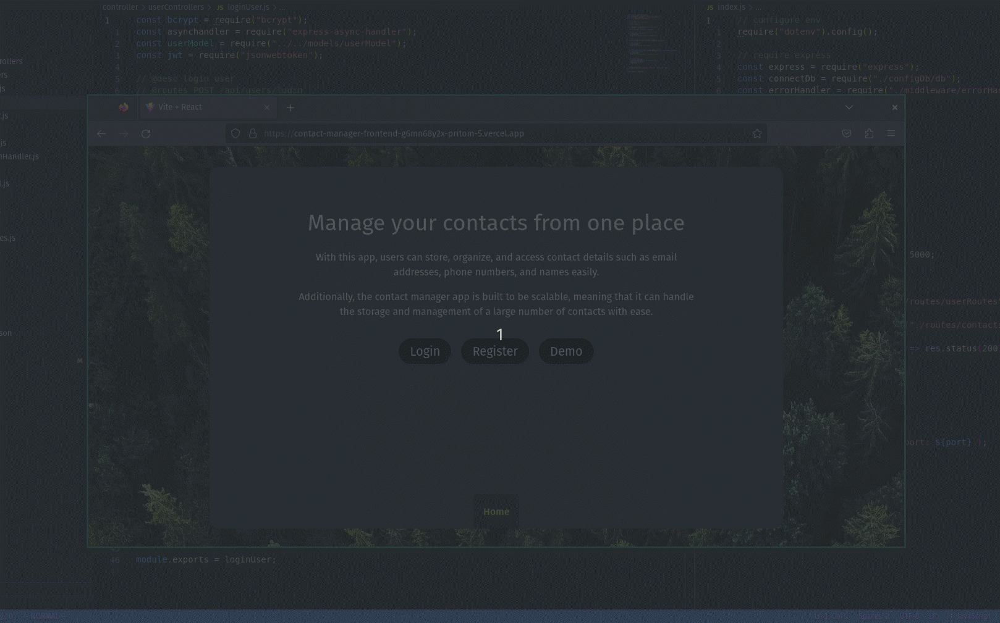

# Contacts Manager App (backend)

This app is the backend part of the Contacts-manager app.

 

---

## Live Demo:

| Desc                    | LINK                                                                                                       |
| ----------------------- | ---------------------------------------------------------------------------------------------------------- |
| Backend API Live link   | [contacts-manager-api](https://contact-manager-fullstack.onrender.com/api/hello)                                     |
| Full stack website demo | [contacts-manager-full-stack-app](https://contact-manager-frontend-g6mn68y2x-pritom-5.vercel.app) |

 

---

## APP Demo:

 

---

## Frontend github repo link:

[Front-end-github-link](https://github.com/pritom-5/Contact-Manager-Frontend)
 

---

## Techstack:

 

 

---

## API Endpoints:

| Name                 | Description                                                                                                                               | LINK                      | Request Type |
| -------------------- | ----------------------------------------------------------------------------------------------------------------------------------------- | ------------------------- | ------------ |
| Register User        | New user can register   Fields: - Username - Email - Password                                                                         | domain/api/users/register | POST         |
| Login User           | User can login to get access to the saved contacts   Fields: - Username - Password                                                    | domain/api/users/login    | POST         |
| See all the contacts | User can see all the contacts saved in JSON format. (Private)    \* Private fields protected for only registered logged in users. | domain/api/contacts       | GET          |
| See single contact   | User can check single contact (Private)                                                                                                   | domain/api/contacts/:id   | GET          |
| Add contact          | Add new contact to the list                                                                                                               | domain/api/contacts       | POST         |
| Edit contact         | Edit existing contact                                                                                                                     | domain/api/contacts/:id   | PUT          |
| Delete contact       | Delete existing contact                                                                                                                   | domain/api/contacts/:id   | DELETE       |

 

---

## Run the app:

To run the app in you own machine

- Clone the repo.
- `Run npm install` to install all the dependencies
- `npm run dev` to start local server
